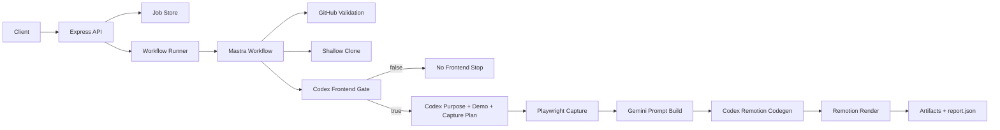

# Architecture Blueprint (Phase 1)

## 1. Overview
The service is a Mastra workflow-based asynchronous job runner that transforms a public GitHub repository into either:
- an early-stop no-frontend report, or
- a rendered MP4 demo built from generated Remotion code.

## 2. Component Graph

## 3. Runtime Components
- API Service (`src/api/server.ts`): request validation, idempotency behavior, status/artifact endpoints.
- Job Store (`src/storage/job-store.ts`): persistent lifecycle + step records.
- Workflow (`src/workflows/repo-to-remotion-workflow.ts`): deterministic step graph and branch handling.
- Ingestion (`src/ingestion`): GitHub metadata validation and shallow clone.
- Codex Adapter (`src/analysis`): fresh `codex exec` tasks for structured and markdown outputs.
- Capture (`src/capture`): command execution + readiness checks + Playwright screenshots + deterministic placeholder fallback.
- Gemini Builder (`src/agents/gemini-prompt-builder.ts`): one internal prompt synthesis call.
- Remotion (`src/remotion`): project materialization and MP4 render.

## 4. Branching Semantics
- Branch decision is based on `detectFrontendWithCodex` output `hasFrontend`.
- False branch executes `noFrontendStop` and marks downstream work skipped.
- True branch continues full analysis/capture/generation/render path.

## 5. Trust Boundaries
- User input (`repoUrl`, `ref`) is untrusted.
- Cloned repository code is untrusted and executed only via controlled commands.
- Model outputs are schema-validated before use in deterministic steps.

## 6. Observability and Persistence
- Step lifecycle status tracked per job.
- Terminal report written to deterministic path.
- Artifact paths recorded in API-visible manifest.
