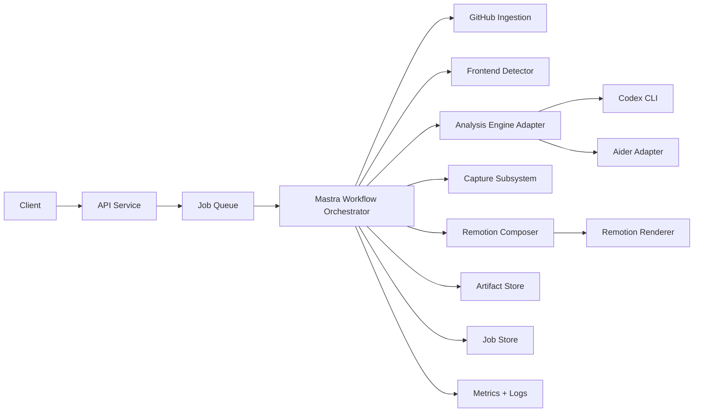
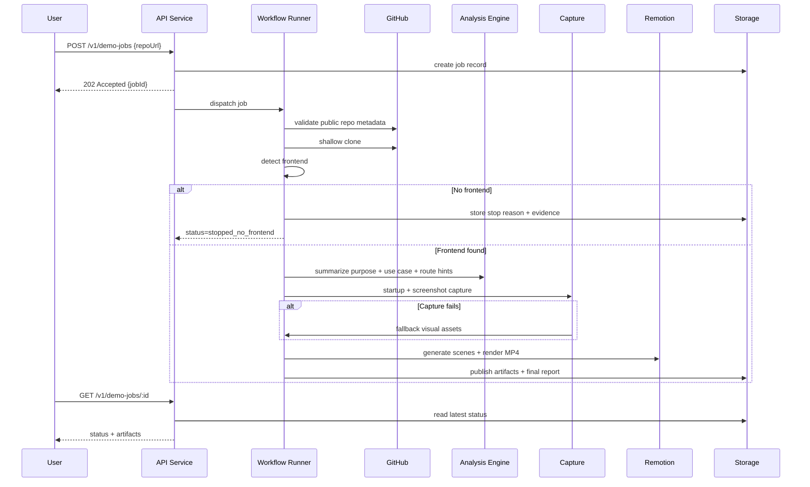

# Architecture Blueprint

## 1. Overview
This document defines the target system architecture for the Repo-to-Remotion Demo Agent. It describes runtime components, trust boundaries, data flow, and execution responsibilities.

## 2. Design Principles
- Deterministic gating before expensive processing.
- Structured outputs and schema-first validation.
- Adapter-based analysis engine abstraction.
- Isolated execution for third-party code.
- Fail-soft behavior via fallback visuals.

## 3. Logical Architecture

## 4. Runtime Components
### 4.1 API Service
Responsibilities:
- Validate incoming payloads.
- Create jobs and return `jobId`.
- Expose status and artifact endpoints.

Constraints:
- Stateless request handling.
- Idempotent create semantics via idempotency key.

### 4.2 Job Queue / Dispatcher
Responsibilities:
- Persist queued jobs.
- Dispatch work to workflow runners.

Constraints:
- At-least-once dispatch with idempotent workflow steps.

### 4.3 Mastra Workflow Orchestrator
Responsibilities:
- Execute ordered step graph.
- Record step transitions and outputs.
- Handle retries for safe steps.

Step graph:
1. `validateInput`
2. `fetchRepo`
3. `detectFrontend`
4. `analyzePurpose`
5. `planUseCase`
6. `captureVisuals`
7. `generateRemotion`
8. `renderVideo`
9. `publishArtifacts`

### 4.4 Ingestion Service
Responsibilities:
- Parse GitHub URL.
- Confirm public visibility.
- Clone repository snapshot.

Safety controls:
- Shallow clone.
- File/size/time limits.
- Temp workspace isolation.

### 4.5 Frontend Detection Service
Responsibilities:
- Compute frontend confidence score.
- Emit evidence for decision traceability.
- Trigger hard-stop when infeasible.

Inputs:
- Repository path.
- Configurable detector thresholds.

Outputs:
- `hasFrontend`, `confidence`, `framework`, `appRoots`, `evidence`.

### 4.6 Analysis Engine Adapter
Responsibilities:
- Normalize agent backends under a common interface.
- Provide structured outputs for:
- repo purpose
- use case
- suggested routes/states

Backends:
- Primary: Codex CLI non-interactive execution.
- Secondary: Aider adapter (future parity).

### 4.7 Capture Subsystem
Responsibilities:
- Determine package manager and start strategy.
- Attempt runtime startup and UI screenshot capture.
- Fallback to static visual synthesis if startup fails.

Isolation:
- No host secrets.
- Limited command allowlist.
- Timeout and process cleanup.

### 4.8 Remotion Composer + Renderer
Responsibilities:
- Convert analysis + visuals to scene specification.
- Materialize composition props.
- Render MP4 artifact.

Output bundle:
- `report.json`
- `demo-scenes.json`
- `remotion-project/`
- `demo.mp4`

### 4.9 Persistence and Telemetry
Responsibilities:
- Store lifecycle data and per-step payloads.
- Emit metrics and structured logs.
- Support run replay and debugging.

## 5. Data Flow

## 6. Trust Boundaries
### Boundary A: External User Input
- Untrusted `repoUrl` and optional refs.
- Strict parsing and validation required.

### Boundary B: Third-Party Repository Code
- Untrusted repo contents.
- Must execute in isolated temp workspace with sanitized env.

### Boundary C: Agent-Generated Content
- Structured validation mandatory before downstream use.
- Reject malformed/unsafe outputs.

## 7. Failure Model
Terminal outcomes:
- `stopped_no_frontend`
- `failed`
- `completed`

Terminal error categories:
- `INVALID_REPO_URL`
- `REPO_NOT_PUBLIC`
- `CLONE_FAILED`
- `NO_FRONTEND_FOUND`
- `ANALYSIS_FAILED`
- `FRONTEND_START_FAILED`
- `RENDER_FAILED`

## 8. Scalability Strategy
- Queue-based async execution.
- Bounded concurrency for clone/analyze/render tasks.
- Artifact retention policy with lifecycle cleanup.
- Configurable limits for large repositories.

## 9. Security and Compliance Posture
- Public GitHub only in v1.
- No secret mounting into target runtime.
- Command allowlist for install/start flows.
- Cleanup policy for temporary workspaces and orphan processes.

## 10. Deployment Topology (Recommended)
- API container.
- Worker container with rendering dependencies.
- Shared artifact storage volume/object store.
- Centralized logs and metrics backend.

## 11. Evolution Path
- Add private repo auth.
- Add richer scene templates.
- Add engine routing by repo characteristics.
- Add rerun-from-failed-step support.
